# 🌾 Nice Rice – Real-time Chat Application

**Nice Rice** is a cross-platform real-time chat application built with **React Native**, providing a smooth, secure, and modern messaging experience. It supports 1-1 messaging, group chats, profile management, notifications, and user moderation — all powered by a scalable backend and real-time socket communication.

---

## 🚀 Features

- ✅ **Real-time Messaging** with [Socket.IO](https://socket.io/)
- 👥 **Group Chat** with member management and renaming
- 👤 **User Profiles** – View and update your own and others’ profiles
- ⚠️ **Report & Delete Users** – Admin moderation tools
- 🔔 **Push Notifications** with [Firebase Cloud Messaging](https://firebase.google.com/docs/cloud-messaging) and Notifee
- 📅 **Message History Grouped by Date** – with local cache
- 🔍 **User & Group Search** – Smart and fast filtering
- 🔄 **Auto-update with CodePush** – Hotfixes without app store resubmission

---

## 🧱 Tech Stack

### 🖥 Frontend

- React Native
- Redux Toolkit / Redux thunk
- FlashList (for performant chat list)
- Notifee (for push notifications)

## 🗂️ Folder Structure

### 🔧 Backend

- Node.js + Express
- WebSocket / Socket.IO
- DynamoDB or MongoDB (NoSQL DB)
- JWT Authentication

### ☁️ Others

- Firebase Cloud Messaging (FCM)
- Firebase Auth
  = Firebase Crashlytic
- Realm (for local caching)

## 📷 App Screenshots

<p align="center">
  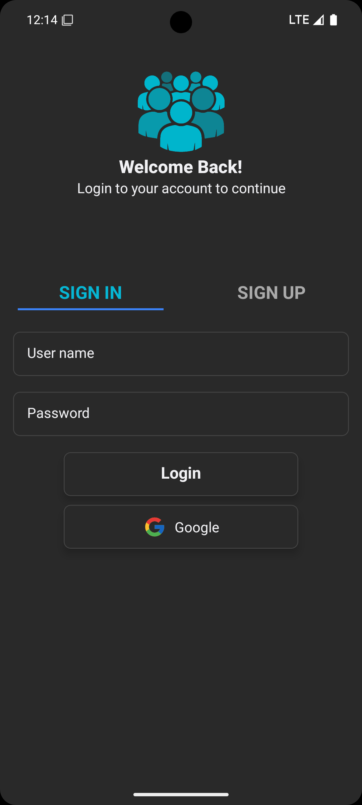
  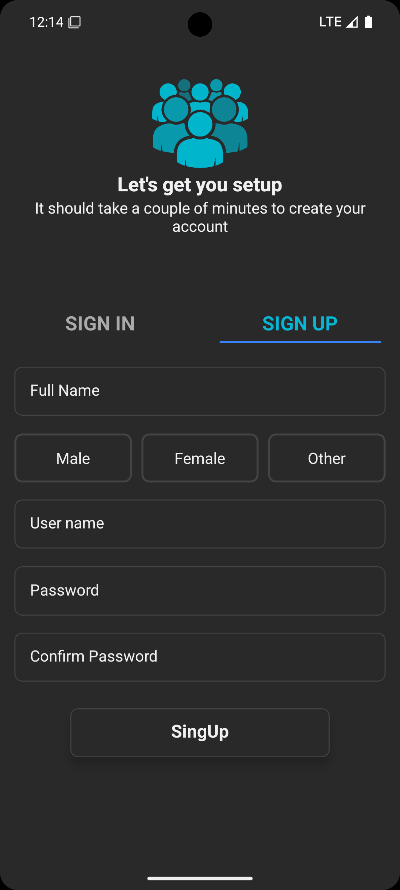
  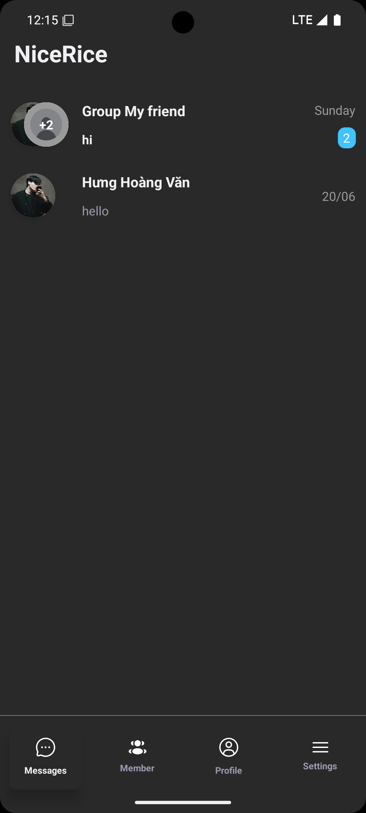
</p>

<p align="center">
  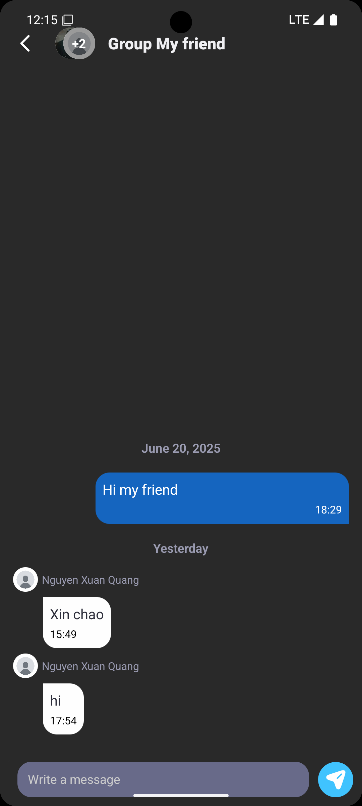
  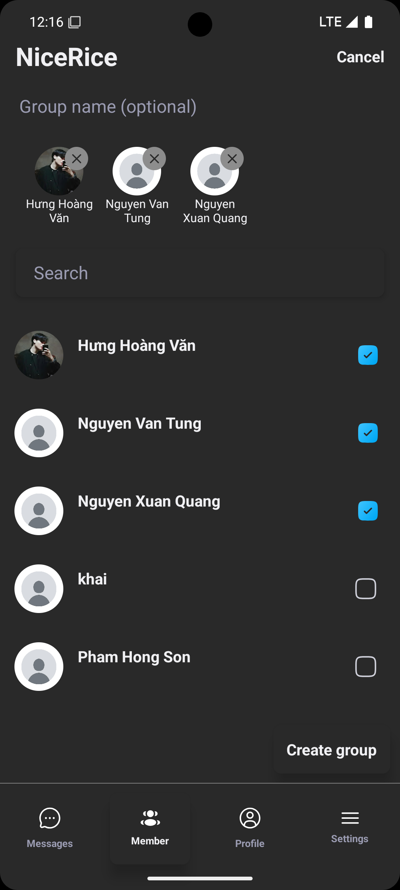
  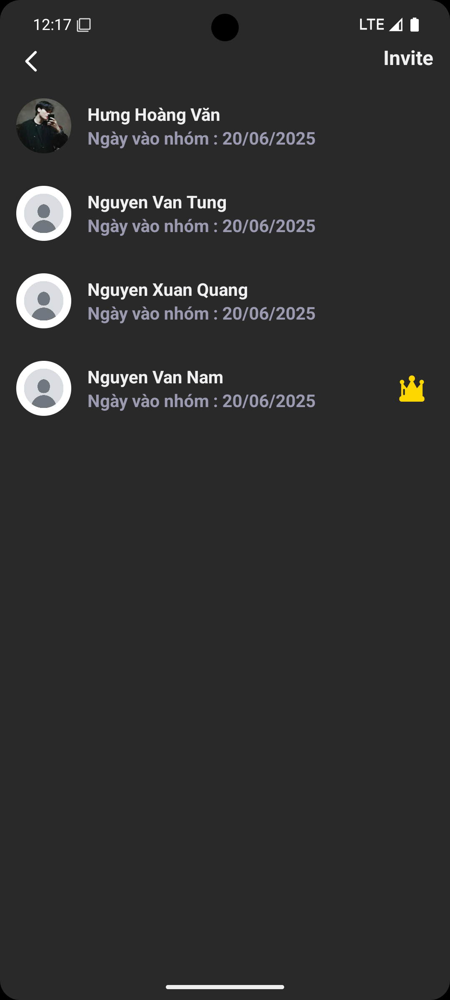
</p>

<p align="center">
  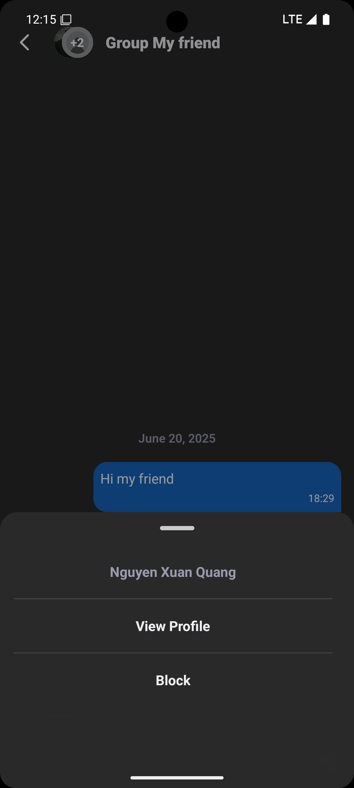
  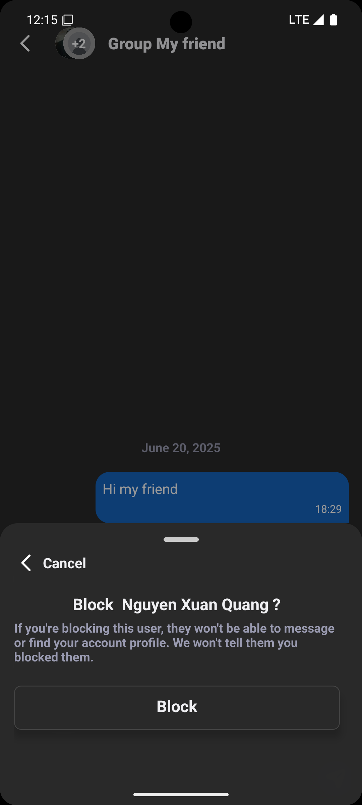
  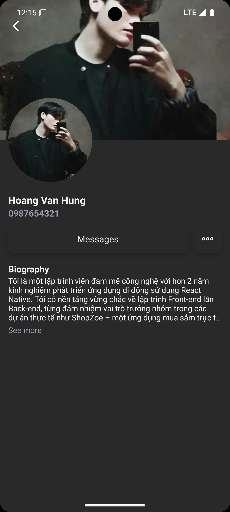
</p>

<p align="center">
  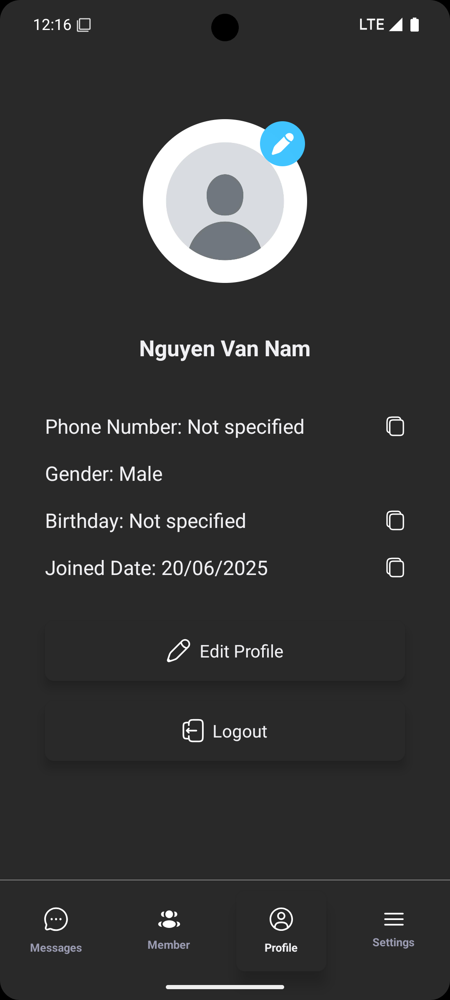
  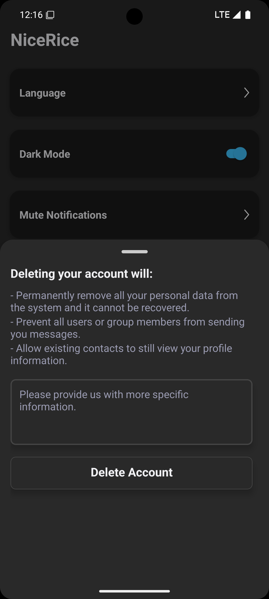
  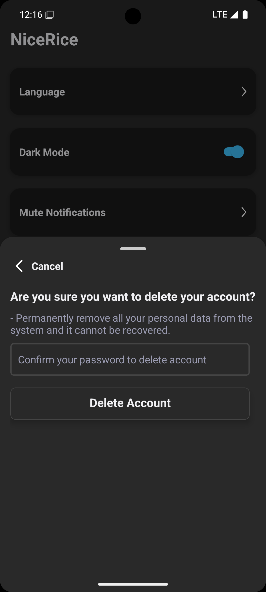
</p>
<p align="center">
  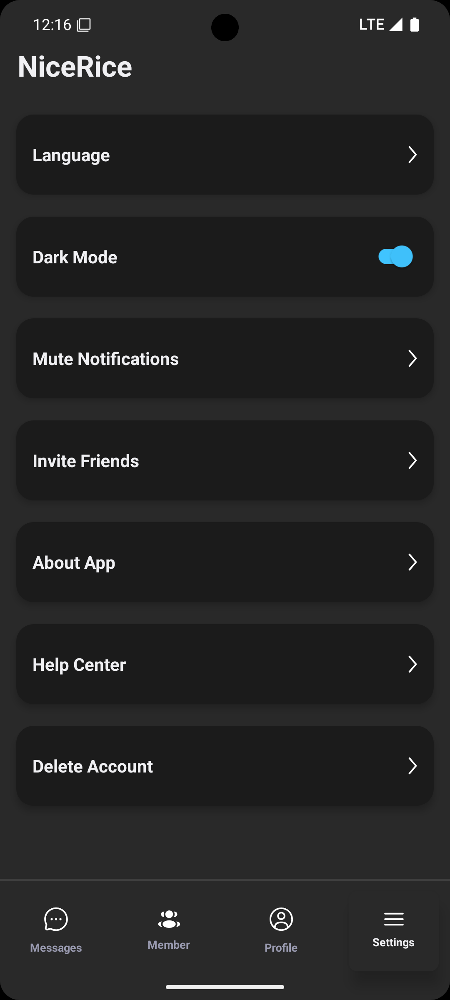
  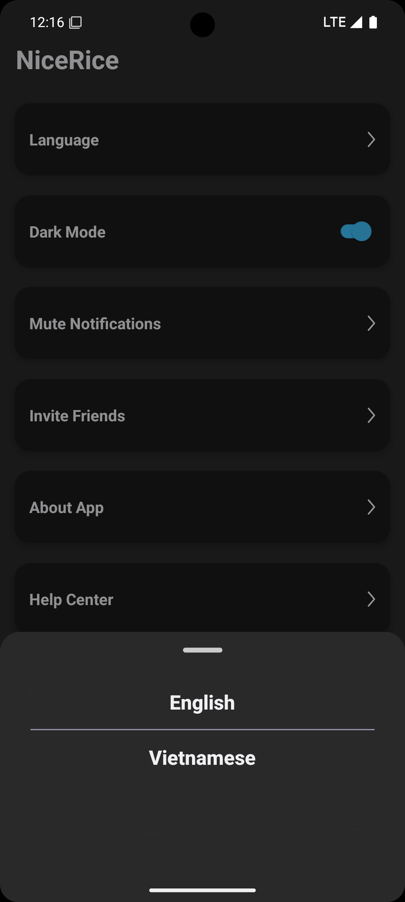
</p>

### 📦 Clone the repo

```bash
git clone https://github.com/yourusername/nice-rice.git
cd nice-rice
```

## 🙋‍♂️ Author

Hoàng Văn Hưng
– React Native Developer

- Portfolio: github.com/giahyng1502
- Email: hungcy1502@gmail.com
